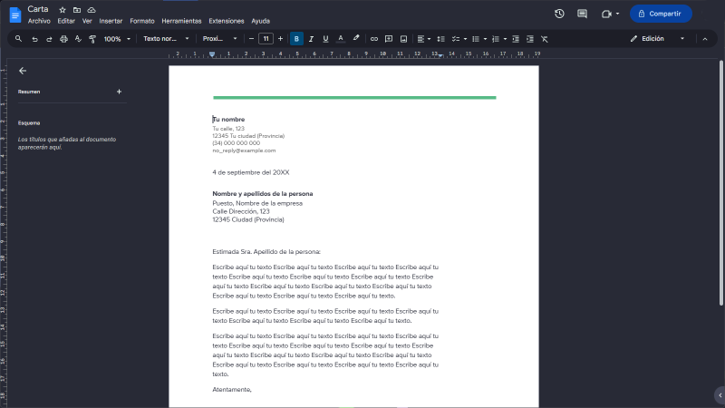
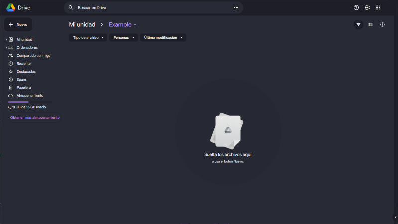
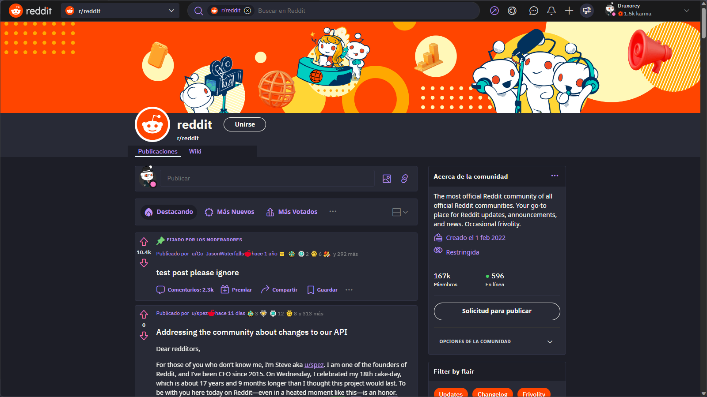
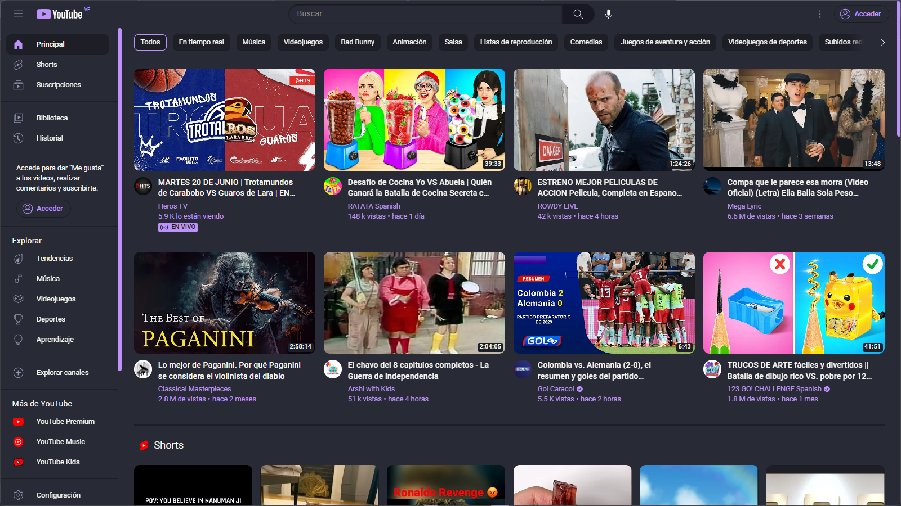

# StylusThemes
This repository contains a collection of themes for Stylus, the best add-on to customize your browser. Here you will find themes of all kinds: dark, light, colorful, minimalist, etc. You just have to choose the one you like the most and apply it with a single click. Do not wait any longer and give a touch of style to your navigation!

## Google Docs

## Google Drive

## Reddit

## Youtube

## Credits

- Original color theme by https://github.com/dracula/dracula-theme
- Original google docs style by Walter winghongchan
- Original  reddit style by chickenblast
- Original youtube style by winghongchan
